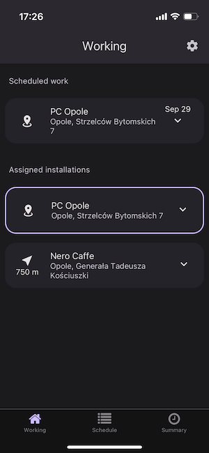

# Main screen

After successful login, the main application screen will be displayed. An example from iOS is below.

At the top of the screen there is a title bar with the name of the currently open screen and an icon for access to application settings.
Below is the operational part of the application where the main work will take place.
At the very bottom there is the app's main menu.

The image below shows an example of what the application will look like right after logging in. The app is running on iOS in dark mode.



## Working

The **Working** screen displays different data depending on whether the installer has already started work in a given installation or has not started work in it.


Until the installer selects an installation and starts working in it, the Working screen will display a list of installations assigned to it and the installations with the scheduled start date.

The listed installations can be expanded to display additional information and, depending on the distance, start navigation to a given location or start working there.

After starting work in a given installation, the Working screen switches to the mode of displaying information regarding only the selected installation.
```
Here you will find a description of the installation tails.
```


## Schedule

The Schedule screen displays data of all installations for a given user divided into two groups:
- Assigned installations - installations assigned to a user on the Users or Installations page. Work on assigned installations can be started regardless of the date, the only condition is the presence of the installer in a given location.
- Scheduled installations - installations in which the work for the installer has been planned for a specific day. In such a case, the start of working time registration can only be started on a given date. This date is displayed on the right side of the record in the list, planned works in installations are sorted from the earliest planned to the latest.


_If the installer has not started recording working time, the Working and Schedule screens display the same data._

## Summary

A screen displaying data with a summary of its work over specific time intervals.