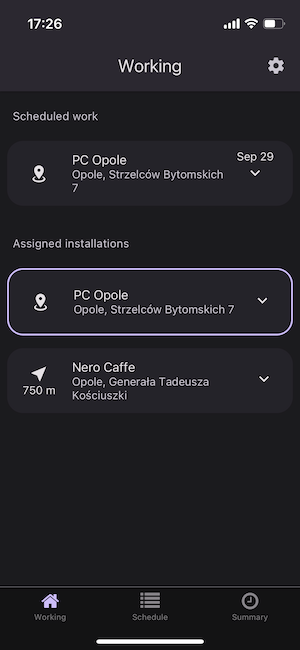

# Home screen

After successful login, the main application screen will be displayed. An example from iOS is below.

At the top of the screen there is a title bar with the name of the currently open screen and an icon for access to application settings.
Below is the operational part of the application where the main work will take place.
At the very bottom there is the app's main menu.

:::info
When you launch the application, the Working screen is displayed by default.
:::

## Working

## Schedule

## Summary
