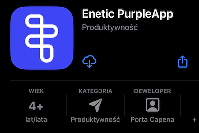

# Installation

Below is the installation process of the Purple App mobile application for devices running Android and iPhones with iOS.

<!-- 
The latest version of the application is version 1.3.1.
-->

## Installation on Android devices

**Requirements:** Android version 5 or higher.

**Installation process:** PurpleApp is available on Play Store, so look for the app and install it like any other software from this store.

You can also look for *Enetic PurpleApp* in the Play Store yourself or use the link below.

[https://play.google.com/store/apps/details?id=com.pcpl.PurpleApp](https://play.google.com/store/apps/details?id=com.pcpl.PurpleApp)

## Installation on iOS devices

**Requirements:** iOS version 13 or higher.

**Installation process:** Scan QR code below with your iPhone camera app and follow the link. It will open the PurpleApp page in the App Store. Click the install button to install the apk in the standard way.

The application is not available through a App Store search engine. You can get it by the link below.
 
[https://apps.apple.com/us/app/enetic-purpleapp/id6462684635](https://apps.apple.com/us/app/enetic-purpleapp/id6462684635)

<!-- 

-->
