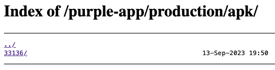
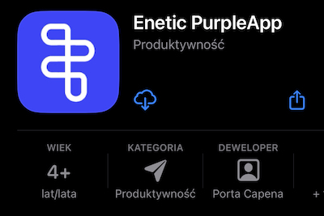

# Installation

Below is the installation process of the Purple App mobile application for devices running Android and iPhones with iOS.

## Installation on Android devices

Requirements:
- Android version 5 or higher.
- Developer mode anabled.

Installation process:

Open the download folder from the link below. It requires a password, which can be found on Passbolt (enetic apps download).

https://artifacts.enetic.eu/purple-app/production/apk/

After entering the link, you need to select the branch and then the directory with the specific build, preferably the latest one. Check it by forlder date/time or just select the higher folder name.

Download the apk file, put it on your device and then install the app. Development mode should be enabled.

## Installation on iOS devices

Requirements:
- iOS version 13 or higher.

The application is already added to the App Store, but is not available through a standard search engine.

Installation process:

To get the app, open the link below on your iPhone, it will open the PurpleApp page in the App Store, then proceed as with a regular software installation from this source.

https://apps.apple.com/us/app/enetic-purpleapp/id6462684635

In order for the application to be installed and used on your device, iOS version 13.0 or higher is required.
App can be installed on iPhone, iPod or iPod Toouch.

