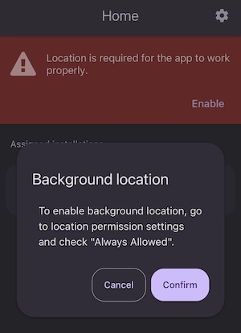

# Location settings

The app requires constant access to location services on both, Android and iOS, to work correctly also in the background and when the device is locked (sleep mode).

##  Access to location services

After starting the PurpleApp and logging in to the system, info will appear about granting appropriate access rights for the app to access the device's location services.

Once the application gains access to location services, it will no longer ask for it the next time you launch it.

Device location is recorded only when work time registration is turned on. When the application is running, the user is logged in, but the work is not started in the app, only whether the device is in the area of ​​assigned installations is checked, and this data is not recorded.

:::info
Access rights must be set to **Always Allowed**. This is required for the services to work when the device's screen is off or the app is running in the background.
:::

## Location tracking

Granting access to location services at all times does not mean that this data is checked and collected at all times and that the user is tracked at all times.

### Stand by mode
_Just checking if you are at installation place, no data kept._

The app starts checking the device's current location when you launch it. The purpose of this is to correctly indicate whether the installer is already at the location of the assigned and planned installations or to determine the distance to them. At this stage, the location is only checked and the data is not saved and kept.

### Working mode
_Registering location only from start till end work._

Once the installer is in the designated area, he can start working there. This is marked in the mobile application and the device's location begins to be saved even when the device's screen turns off. After you finish working in the mobile application, recording the device's location is stopped. The application goes from working mode to waiting mode.