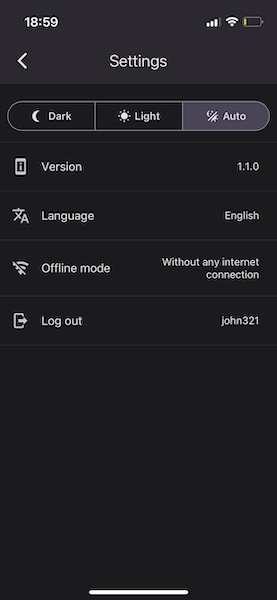

# Settings screen

In top right corner of the app screen there is a gear icon with settings.

The application allows you to change several parameters:

- **Dark / Light / Auto** - Dark or light theme of the app. Selecting "auto" will set the theme to the one currently selected in the device.
- **Version** - Version of the currently running application.
- **Language** - Application language. Currently available languages are English and Polish. By default, the app will launch with the device's system language (if possible).
- **Offline mode** - Selection of offline mode. There are several possibilities listed below.
- **Log out** - Logging out of the mobile application.

Selection of offline mode:
- Without any internet connection -  Default setting. Offline mode will be turned on if the device doesn't have any access to the Internet.
- Without Wi-Fi connection - Offline mode will be activated if the device doesn't have access to the Internet via Wi-Fi. If the device has access to the Internet via mobile network, it will not be used to transmit PurpleApp data.
- Always on - Forced permanent use of offline mode. The application will not transmit data, it will be stored in local storage. 

_Logging into the system requires an internet connection and working online mode. The same applies to data synchronization regarding finished work._
