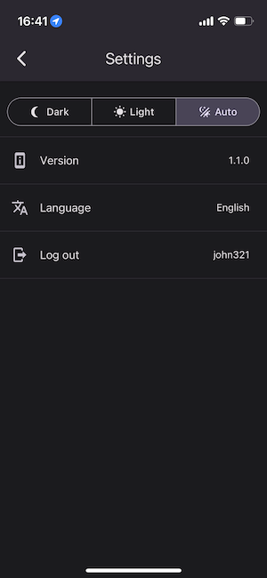

# App settings

In top right corner of the app screen there is a gear icon with settings.

The application allows you to change several parameters:

- **Dark / Light / Auto** - Dark or light theme of the app. Selecting "auto" will set the theme to the one currently selected in the device.
- **Version** - Version of the currently running application.
- **Language** - Application language. Currently available languages are English and Polish. By default, the app will launch with the device's system language (if possible).
- **Log out** - Logging out of the mobile application.

