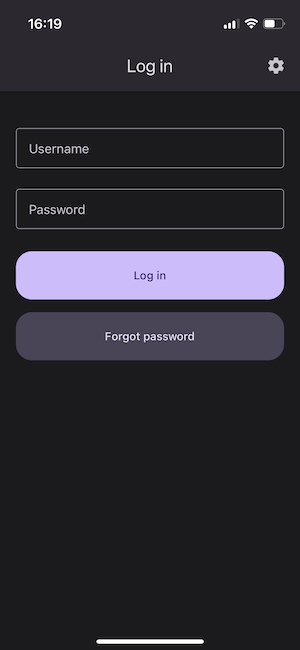

# Launching the app

After starting the application, the login screen will appear. 

In addition, at the top right of the screen there is a settings icon where you can change the language. Currently available languages are English and Polish. The application will launch with the device's system language by default.

## Logging in

After starting the application, a login form is displayed. Enter your username and password in the appropriate fields and press the `Log in` button.

## Forgot password

If you forget your password, select the `Forgot password` button and enter your username on the next screen. An email with a link to create a new password will be sent to the email address linked with the user.

