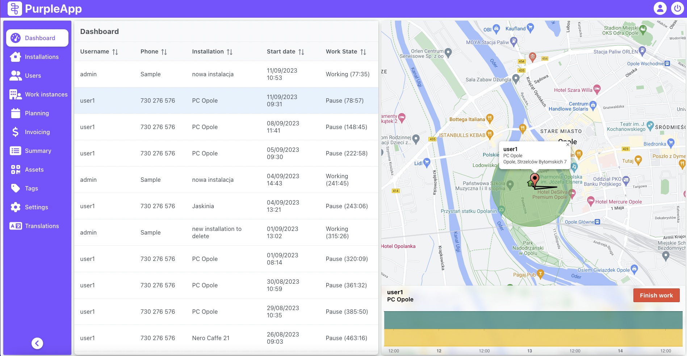

# Dashboard

The Dashboard screen consists of two parts. On the left there is a list of currently active/working installers, and on the right there is a map with the marked positions of installers and installations along with the geofencing area.

The installer position is updated from time to time. This happens when activity and status changes and, depending on the system: 
- for Android - every 5 minutes,
- for iOS every 50m of his movement.

Sample view of the Dashboard screen

## The list

The list on the left contains information about working installers. The individual columns contain details about:
Username - installer login in the system
Phone - installer's phone number (not required in installers details)
Installation - the installation place in which the installer is currently working
Start date - date and time of starting work in a given installation
Work status - current status and its duration (working, pause)
Data can be sorted by each column.

## The map

After selecting an installer from this list, the map on the right will focus on that user. Its last recorded position, GPS track and the area around the installation in which geofencing is active will be marked (while in this area, the installer can start work).

## Map bottom panel

In addition, a panel with details of the installer's presence in a given installation will appear under the map. The chart shows the presence of the installer in the location from the moment he started working there. The upper bar shows the presence in the geofencing area, the lower one shows the duration of a given status.

Top color bar:
- green - the installer was in the address
- gray - installer outside the address

Bottom color bar:
- blue - work
- yellow - pause

Installation name on the panel it's a link to this installation page details.

The red Finish work button allows the installer to force end his work, e.g. if he forgot to do it in the mobile application.