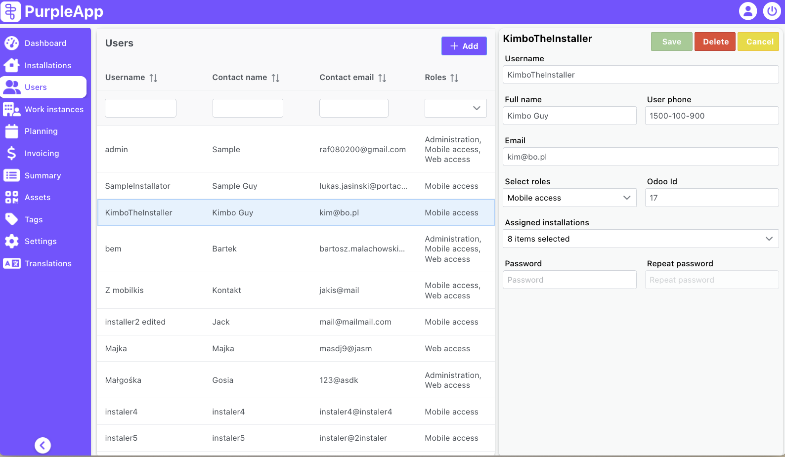

# Users

The Users screen consists of two parts. On the left there is a list of all users registered in the system. On the right side, details of the selected user are displayed.

### Users list
The user list contains the user's login and full name, contact email address and roles in the system. The list can be sorted and filtered by any column.
After finding and selecting user from the list, user's data will be displayed on the right side of the screen.

Also, at the top right there is an Add button used to create a new user in the system. After clicking it, on the right side of the screen an empty form will be displayed. After completing all required fields, you will be able to save new user.

### User details

At the top left of the right panel there is the name of the selected user. Next to it there are save, delete and cancel buttons.
**Save** - Creates a new user or updates the details of an existing one. Available after making changes to the displayed data or after completing the required fields for a new user. 
**Delete** - Deletes currently displayed user. The action must be confirmed. The button is unavailable when creating a new user.
**Cancel** - closes the currently displayed user details.

Data fields:
**Username** – login with which the user will log in to the system/mobile app (preferably short, spaces are allowed).
**Email** – user's email.
**Contact name** – user's full/real name.
**Contact phone** – user's phone number.

**Select roles** - user role and permissions in the system. Multi-select is possible, so web user can also have access and log in the mobile app. Possible options:

- Mobile access - Default role for installers. It allow to log in and work in the mobile app.
- Web access - Allow to create users and installations. Planning and monitoring the work of installers. Confirming and pushing work data to Odoo. 
- Administration - the same permissions like for web access, but also gives access to Settings and Translations from the main menu.

**Odoo Id** – used for linking PurpleApp users with Odoo contacts. this field is available only when mobile access was selected in role dropdown. Odoo contact must be created first, then use the value of Installer Id field in Odoo and set it here.

_OdooId field is currently required to create a new (mobile) user. This requires access to Odoo and creating a contact there as well. For this reason, this field will be changed to not required. This does not generate the problem of incorrect data synchronization with Odoo because the appropriate validations are already implemented in the section responsible for communication with Odoo._

**Assigned installations**  - list of installations to which the user is assigned to. It’s selected from multi-select list, so many installation can be set for the user. The work of a given installer can be planned in a given installation even if he is not assigned to it. 
These installations are visible to the installer in the mobile app in to the main screen in assigned installations section.

**Password** - password used to log in the system, for the web and mobile app. It must consist of at least 8 characters. When editing user data, this field can be left empty, then only the user's data will be updated and the password will remain unchanged.

**Repeat password** - password confirmation field, type it again to avoid typos, it must be the same as in the previous field.

