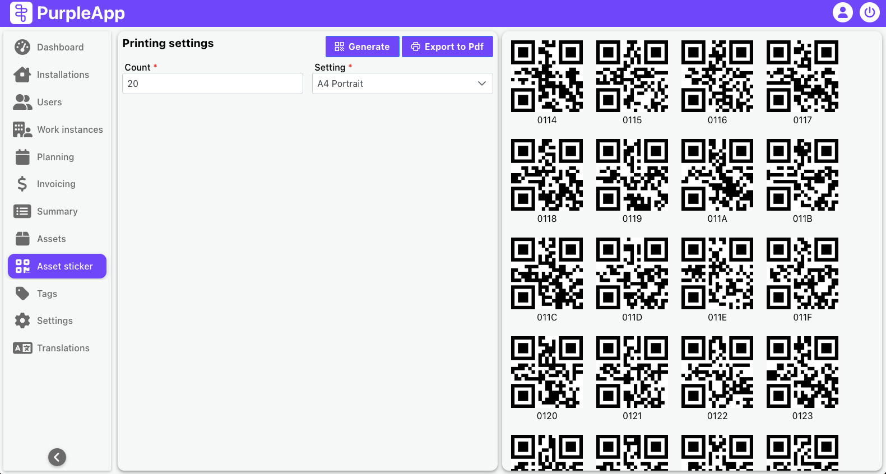

# Asset sticker

## Overview

The Asset Sticker feature provides a tool for generating and printing QR code stickers for assets. These stickers can be used to identify and track assets within the system, especially when existing QR codes are missing or damaged. The feature generates unique hexadecimal-based QR codes, which can then be printed and affixed to the assets. Multiple QR codes can be associated with a single asset, allowing for redundancy and flexibility in asset tracking.

These codes can be used to stick on assets, e.g. when there is no QR code on the asset and it must be registered in the system or the existing QR code has been damaged and cannot be read again.

The system allows to register a unit of asset with multiple QR codes. We gain access to the asset after scanning one of the assigned codes.

_One A4 page can fit 15 QR codes. It doesn't matter landscape or portrait mode._

The code is generated based on a four-character number written in the hexadecimal system. Each subsequent number is an increment of the previous one, and the last result is stored in the database.
Thanks to this, the uniqueness of the codes generated by the tool is guaranteed.

