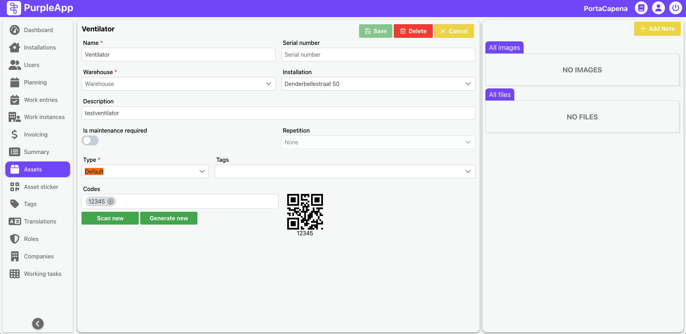

# Assets

## Overview
The **Assets** page is designed for managing devices that are installed or serviced in specific installations. It provides users with detailed insights into both registered devices awaiting installation and those already installed. Additionally, users can manage attached files such as photos, manuals, and other documentation, as well as track scheduled maintenance timelines.

Assets marked as installed in a given installation can be utilized on the **Building Plan** page and within the **Installation Details** view to define their exact position on the location's layout. This functionality significantly improves the ability to locate specific devices, especially in large-scale projects or locations with densely installed equipment.

_Building plans for specific location can be found in specific Installation details page. Look for Building Plan tab._

## User interface

The Assets web data is divided into two screens:

- Assets list screen
- Assets details screen

### Assets list
The first screen displays a comprehensive list of devices registered in the system. This list can be filtered based on various attributes to help users quickly find specific assets.

**Filters**:

  - Name
  - Installation location
  - Device type
  - Maintenance schedule
  - Serial number

Provides a quick overview of registered devices and their key attributes.

### Asset Details
The second screen provides detailed information about a selected asset, with options for editing its attributes. This screen offers advanced management capabilities for individual devices.

**Atrubutes**:

  - Name
  - Serial number
  - Installation location
  - Description
  - Details on required maintenance
  - Frequency of maintenance (e.g., monthly, annually)
  - Assign a QR code to the asset for easier identification.
  - Attach images, manuals, and other documents related to the device.

## Benefits

- **Enhanced Device Tracking**: Ensures efficient management and quick identification of devices.
- **Improved Maintenance Scheduling**: Provides clear visibility of inspection timelines.
- **Comprehensive Documentation**: Supports attaching relevant documentation for easy reference.
- **Simplified Equipment Location**: Integration with the **Building Plan** allows for precise placement of assets within an installation.
