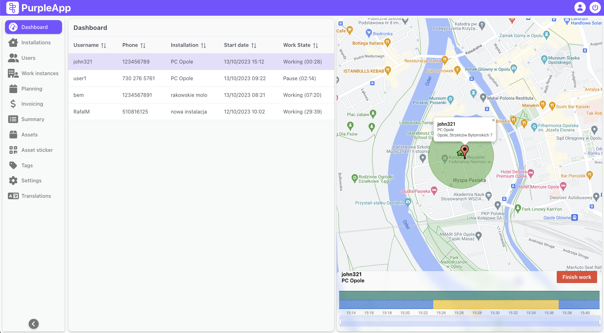
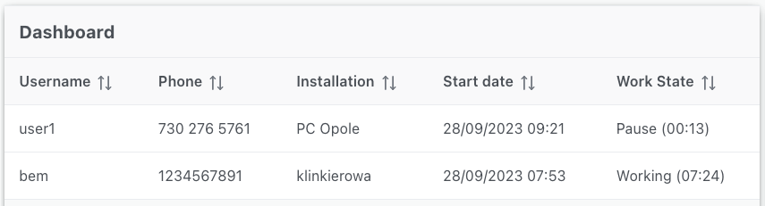
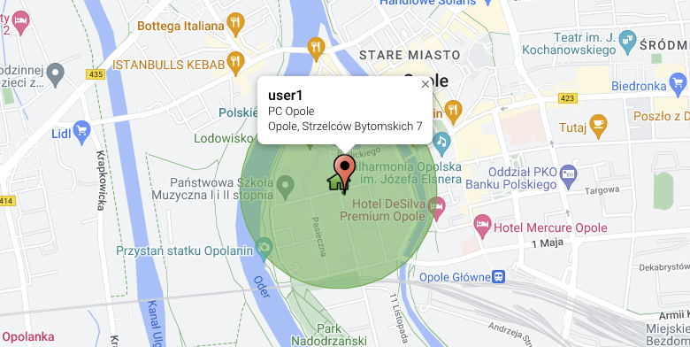
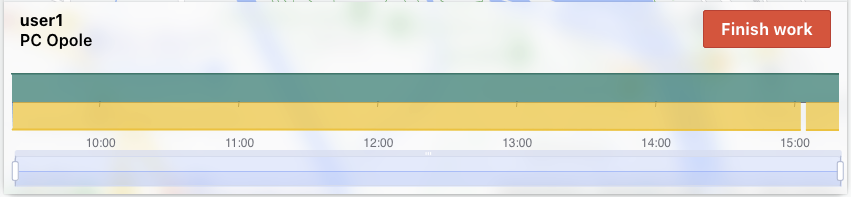

# Dashboard

## Overview

The Dashboard screen provides a real-time overview of workers activity and location.  It displays a list of active installers with their status and current assignment, alongside a map visualizing their positions and geofenced installation areas.  This allows administrators to monitor installer progress, manage assignments, and ensure efficient operations.  The Dashboard also offers detailed work charts for individual installers, enabling analysis of their time spent at installations and their work status.

The workers position is updated from time to time. This happens when activity and status changes and, depending on the mobile device system: 

- for Android - every 5 minutes,
- for iOS every 50m of movement.

## User interface

The Dashboard screen consists of two parts. On the left there is a list of currently active/working installers.On the right there is a map with the marked positions of installers and installations along with the geofencing area. Below the map there is a time chart for selected worker.

### Users list

The list on the left contains information about working installers. The individual columns contain details about:
**Username** - installer login in the system. 
**Phone** - installer's phone number (not required in installers details). 
**Installation** - the installation place in which the installer is currently working. 
**Start date** - date and time of starting work in a given installation. 
**Work status** - current status and its duration (working, pause). 

Data can be sorted by each column.

## The map

After selecting an installer from this list, the map on the right will focus on that user. Its last recorded position, GPS track and the area around the installation in which geofencing is active will be marked (while in this area, the installer can start work).

## Map bottom panel

In addition, a panel with details of the installer's presence in a given installation will appear under the map. 

There is a name of selected user and current installation which is a link to the installation page details.

The red Finish work button allows the user to force end installers work, e.g. if the installer forgot to do it in the mobile application.

_**Finish work** button is only visible to users with administrator privileges._

### Work chart
The chart shows the presence of the installer in the location from the moment he started working there. The upper bar shows the presence in the geofencing area, the lower one shows the duration of a given status.

Top color bar:

- green - the installer was in the address
- red - installer outside the address

Bottom color bar:

- blue - work
- yellow - pause

### Zooming
There is a zoom bar below the chart. Operating the bar can increase the detail of the chart and enable more precise determination of short activities in a workday usually lasting several hours. This is done by defining the period that will be displayed on the chart. 

Moving the left side handle of the bar determines the time from which the chart should start, and the right side handle is responsible for the end of the chart. 

Another zooming method is to select part of the bar (by drag and drop) in its lower part when cursor changes into cross.  

Additionally, adjusted bar can be moved throughout the entire range of recorded working time by holding and dragging by its top part.
