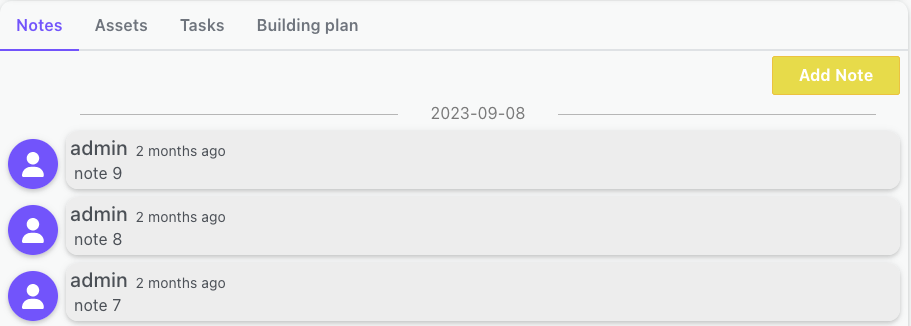

# Installations

## Overview

The Installations feature provides a comprehensive management system for all installation sites. It allows users to view a list of all installations, and access detailed information for each individual site.  This includes managing contact information, assigning installers, defining the geofenced operational area, scheduling work on a calendar, and tracking related activities through notes, asset management, task assignment, and building plan documentation.

## User interface

The Installations web data is divided into two screens:

- Installations list screen
- Installation details screen

In the first screen there is a list of all installations ready to be sorted and filtered by individual columns. 
The second screen is used to display detailed data about the installation itself, assigned installers, calendar of planned works, list of notes, assets and tasks assigned to this installation.

### Installations list screen

The first screen lists all installations created in the system.

At the top right there is an Add button used to create a new installation in the system. After clicking it, a standard screen will open to display installation details with empty fields, a detailed description is provided below. After completing the required fields, you will be able to save the installation.

The list can be sorted and filtered by any column according to requirements to make it easier to find the installation you are looking for.

After finding the installation and selecting it from the list, the screen with its details will be displayed.

### Installation details screen

This screen contains detailed data about the installation, such as address details, planned and completed works, events and various notes (photos, documents).

At the top left there is the name of the selected installation. Next to it there are save, delete and cancel buttons.

**Save** - Creates a new installation or updates the details of an existing one. Available after making changes to the displayed data or after completing the required fields for a new installation. 

**Delete** - Deletes currently displayed installation. The action must be confirmed. The button is unavailable when creating a new installation.

**Cancel** - closes the currently displayed installation details.

### Data fields

On the left side of the installation details screen the following information is displayed:

**Name** – name of the installation, which will be used to represent it in the system. It must consist of at least 3 characters.

**Contact name** – name of the contact person in a given installation. It must consist of at least 3 characters.

**Contact email** – email of the contact person in a given installation.

**Contact phone** – phone number of the contact person in a given installation.

The above contact person details will be displayed in the mobile app (installation details) and it will be possible to use them to make a call, write an text message or send an email to this person.

**Select users** – it is possible to assign installers to installation during it’s creation. Installers selected here will see the installation in the mobile app list in the Assigned installations section. Installers are selected from a multiple-selection list. To select an installer and assign it to an installation, it must already be created in the system.

Installation address:

**Country** – selection of the country where the installation is located.

**City** – city of installation.

**Street** – street and building number.

**Postal code** – postal code of the installation.

### Map and operational area

**Radius** – a radius calculated from an address point on the map, a circle with this radius indicates the geofencing operation area in which installers can work. The start of work can only be initiated within this area, after leaving it the work continues, but the installer's position will be marked on the chart as "outside address".

**Get coordinates button** – shows installation as pin on the map, based on its address. 

**Map** - map with marked installation address and radius. The pin position can be adjusted for better precision and this is highly recommended.
According to Google Maps data, the pin usually indicates the central point of the address or its entrance, which will not always correspond to the installation location. If a given address covers a large area and the radius is relatively small, then there may be a problem with geofencing and starting work by installers.

### Calendar

On the right side of this screen there is a monthly calendar with planned work for installers in this installation. 
The calendar has several settings: the current month can be changed from dropdown, the "Clear selection" button is used to clear selection from all days at once, the gear button is used to hide/display weekends.

Selecting days on the calendar acts as a filter for the data displayed on the tabs below the calendar.

By default, this data is displayed for the entire period in which the events were registered, but this period can be limited by selecting it on the calendar.

It is possible to select specific days on the calendar in one month, switch the current month to another and select another days. Events in the tabs under the calendar will be displayed for all selected days. "Clear selection" clears the selection from all days, including those that are not displayed on the current calendar.

### Tabs

The bookmarks section contains three tabs:

- Notes
- Assets
- Tasks
- Building plan

These tabs contain information about events in a given installation, comments, photos and other files, equipment installed in this place and tasks to be performed.

**Notes** 
This tab contains comments, photos, videos and other files added by both installers and web users of the system. The installer does not have to be present in the installation (or working in it) to add a note.
Notes are sorted according to the date they were added - from the oldest (bottom) to the newest (top). They contain information about the user who added it and, optionally, a comment and an attachment. Graphic files can be directly displayed in the browser in full screen mode (zoomed in/out), other files (pdf, videos, etc.) must be downloaded to the device first.

At the very bottom of the list, all images and attachments have been grouped to make it easier to find what you are looking for.

**Assets** 
Assets tab contains a list of installed assets in this installation. There is an asset name with tags and installation date. Name is a link which redirects to the details page of this specific asset in the system.

**Tasks** 
Task tab with a list of tasks to be performed in this location by installers. The header contains information about the number of completed tasks and the number of all tasks (e.g. 5/20 - 5 completed out of 20 total). Each task contains name, due date and it's state. The completion of the task is marked in the mobile application, and to do this, the installer must work in the given installation. Task can be edited or deleted only if its status is pending. 

**Building plan** 
The tab with building plans contains a list of all imported plans of the currently viewed installation. Building plans are used to set and display the exact location of assets installed in a given installation. 

_Determining and editing asset positions takes place on a separate screen, described here._
