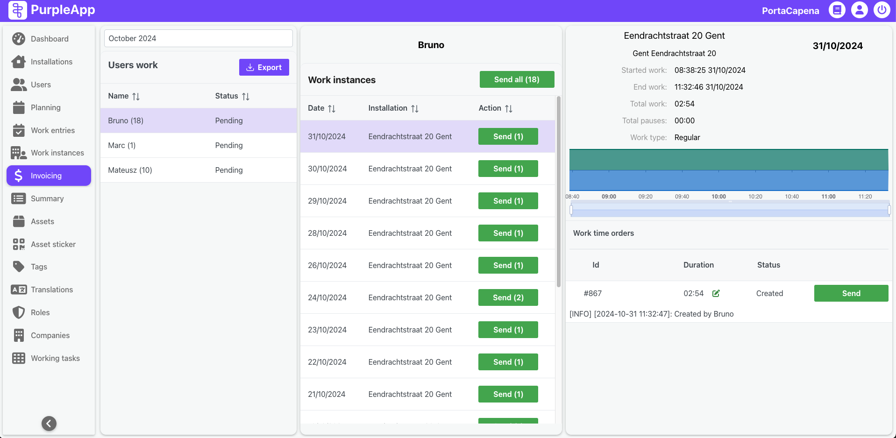
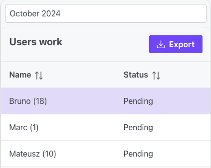
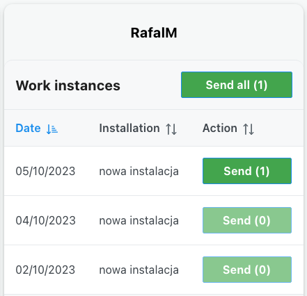
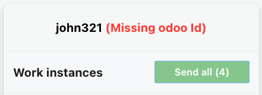
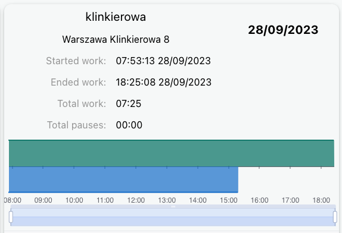
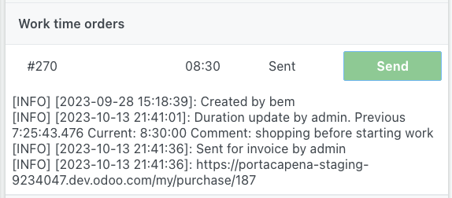
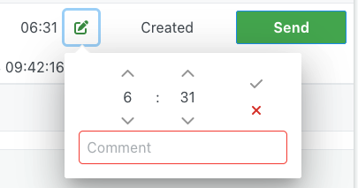
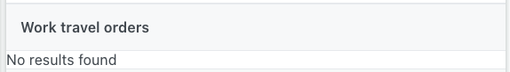

# Invoicing

## Overview

The Invoicing feature streamlines the generation of invoices based on installer work data. It displays installer work hours, allows for corrections to these hours, and then transmits this data to Odoo for further processing. 
  
The connection with Odoo is crucial for automated invoice creation, using the data to generate purchase orders which facilitate the self-invoicing process.
To ensure proper communication with Odoo instance, specific configuration steps are required within both the Purple App and the Odoo environment. 

While integration with Odoo is the primary function, the Invoicing feature also offers the flexibility to export data to an Excel file for situations where a connection to Odoo is not yet established. The Invoicing screen provides an overview of user work summaries, details of individual work instances, and logs related to data corrections and transmission to Odoo.  It enables managing the invoicing process, including adjustments to work hours and tracking the status of data sent to Odoo. 

The data sent to Odoo is used to create purchase orders, which are the basis for the self-invoicing process, issuing invoices on behalf of installers.

## User interface

The Invoicing screen consists of 3 parts:

- Users work
- Work instances
- Orders data

### Users work

At the top of the Users work list is a dropdown for the month for which data is displayed on the Invoicing screen.

Users work section also features an "Export" button located below the month selection dropdown.  This button allows users to download a comprehensive report in Excel file detailing work time. This exported data can be used for reporting, analysis, or as a backup in case of issues with the Odoo integration.

The exported file includes the following information for each instance:

- Work instance ID
- Worker details (pulled from their user profile)
- Location of work
- Work type
- Work start and end date/time
- Invoicing status of the record
- Odoo data (if available)

Below that, users work contains a list of users along with information about the number of work instances whose data are ready to be sent or have already been sent to Odoo. The second column contains information about the status of data sent to Odoo for the active month.

Work instance data sending status:

- Pending - no data from the active month has been sent to Odoo yet.
- Partially Sent - part of the data has been sent to Odoo and the rest is waiting to be sent.
- Sent - data of all job instances created so far have been sent to Odoo.

### Work instances

After selecting a user, a list of work instances of this user from the active month will be displayed in the middle part. 

Above the Work instances header there is the name of the selected user, and next to the header there is a button to send data from all possible work instances of a given user from the active month to Odoo. The button label displays the number of work instances that can be submitted.

Each item on the list contains the start date of a given work instance, the name of the installation to which the instance applies and a Sent button for sending data of a single work instance to Odoo.

If a button on any list item is inactive, it means that the work instance data has already been sent to Odoo, the user doesn't have an OdooId set or for other reasons it is not possible to send data. In such a situation, check the logs on the third part of the Orders data screen.

If the user doesn't have OdooId configured, an appropriate message will appear next to his name. It will not be possible to send job instance data to Odoo, the buttons will remain inactive.

### Orders data

After selecting a work instance from the list, the work instance data will be displayed on the right panel. There you will find some details of the work instance, a chart with the user's location, logs of corrections and data sending to Odoo.

**Work instance details** include:

- Installation name.
- Installation address.
- Time and date of starting work in the installation.
- Time and date of finishing work in the installation.
- Total work - sum of working times (pauses excluded).
- Total pause - sum of pause time.
- Work type - conceptual (desk) or regular (by installers).
- Work graph with location with zooming bar (such as in the work instance details).

**Work time orders**

Here is the work time order number, information about the amount of working hours that will be sent to Odoo and later invoiced, and a button to send data to Odoo.

Below the chart there are logs about the creation of a time order, information about working time adjustments with comments, sending data to, creating a purchase order in Odoo, and possible logs about problems with connecting to Odoo, sending data and creating an order.

Before sending the data, it is possible to correct the amount of hours that will be invoiced in Odoo. To do this, click on the pencil icon next to the working time. Set the correct working time to be sent to Odoo and the reason for the correction. Corrections can be made until the data is sent to Odoo. All corrections along with comments are logged and displayed in the logs section.

Work time correction only affects data sent to Odoo. The data in the work instances remains unchanged.

**Work travel orders** - travel times to installation are not supported yet.
