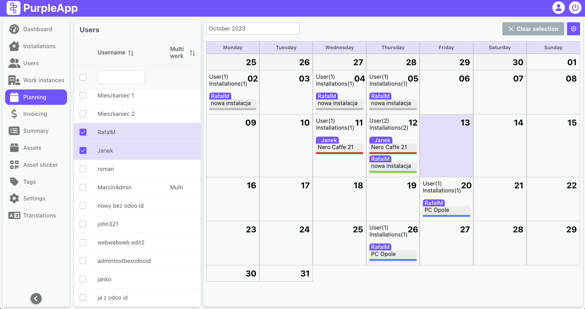
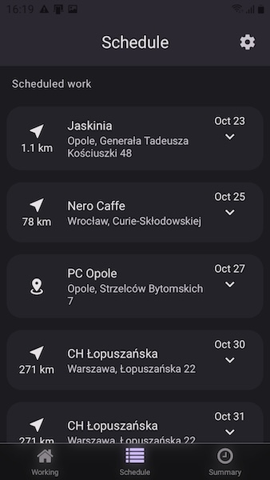
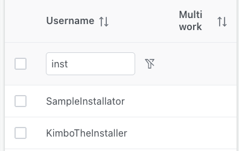
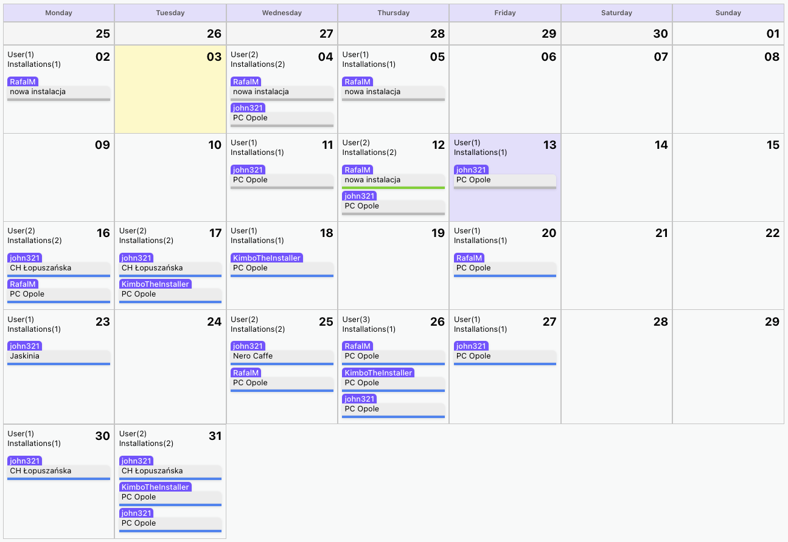
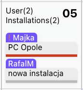
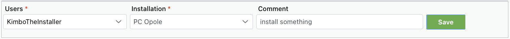
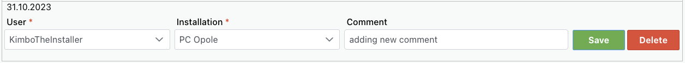
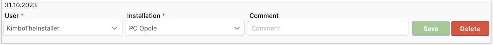

# Planning

## Overview

The **Planning** feature provides a tool for scheduling and monitoring installers work. It allows planners to assign workers to specific locations on designated dates. The interface includes a user list for selecting installers and a calendar for visualizing and planning work assignments. Planned work appears on the calendar and is also visible to workers in the mobile app. The feature supports creating new work instances, editing planned work, and deleting scheduled assignments, enabling efficient resource allocation and work management.

## User interface

The Planning screen consists of two parts: 

- **User list:** List of all users registered in the system, that have mobile app access, so can work in locations. 
- **Calendar:** Displays planned and performed work.

The general workflow of planning consists in to selecting one or more users in the list on the left, then selecting the days on the calendar on which the work is to be performed (you can select several days), and then in the form under the calendar confirming the users, selecting the installation in which the planned work applies, adding an optional comment and saving the new plan.

The effect of such planning is the creation of a new work instance with a pending status for each user for each planned day. The created instances are displayed on the calendar.

The work instance will be also displayed in the user's mobile application in the Scheduled work section, and work can only be started on this particular day.

### Users list

The list contains only those users who have been assigned the mobile access role.
Each line contains the username and information whether a given installer is scheduled to work in various installations in a given month (Multi work).

In the header of the list, it's possible to filter users by name, sort the list and select or deselect all users on the list.

After selecting the installers on the list, their work instances (planned and done without planning) will be displayed on the calendar.

### Calendar

This is where all planning for the future work of installers takes place. The calendar itself can also serve as a tool for monitoring work by verifying the work performed in individual installations by installers.

Above the calendar, on the left, there is a date picker in which we define the currently displayed month. On the right side there are Clear selection and Options buttons.

Clear selection button removes selection from all selected days on the calendar, including those that are not currently displayed because they were selected in a month other than the currently displayed month.  
The gear button shows small Options manu that allows you to hide or show weekends on the calendar, which can improve readability, and allows you to display a color-coded legend.

The calendar displays all work instances of installers selected in the list on the left side of the Planning screen. To have an overview of the work performed and planned in a given month, you can select all users in the list header.

_When we talk about not planned work, we mean work that was or is being performed without creating a work instance on the Planning page. The installer can start work in any installation as long as it is assigned to him and he is in its work area._

If the selected installer has no work planned in the current month or has not performed any work so far, nothing will be displayed on the calendar.

If the selected installer has work instances for the selected month, they will appear in individual calendar cells according to the planned work date or the work start date if it has not been planned.

### Single cell

Each day on the calendar contains general information about:

- Number of users for whom there are work instances on a given day.
- Number of installations for which there are working instances on a given day.

And information about all specific work instances for that day:

- In the purple field, the installer's username.
- In the gray field, the name of the installation.
- The status of a given work instance as a color marking.

Depending on the status and situation, work instances are marked differently. The table below presents individual markings with descriptions.

| Color | Status | Description |
|---|---|---|
|  Blue | Pending | The work has been planned and is waiting to start. The due date for its implementation has not yet passed. |
| Red | Pending | The work was planned but not performed. The due date for its implementation has already passed. |
| Green | Active | Work is started and active. You can follow it on the Dashboard. |
| Grey | Finished | Work completed. |

Details of all work instances visible on the calendar are available on the Work instances page. It will be useful to set appropriate dates and filters to find them.

## User cases

### Planning

Planning in PurpleApp involves determining who, when and where will do the work.

**Who** - the installer for whom the work is planned, selected in the list on the left side of the screen. 
**When** - specific days are selected on the calendar on which he will work, selected days will be yellow. 
**Where** - the installation where the installer will perform his work, set in dropdown under the calendar.

#### Creating new work instances

To plan work, select the installer from the list, then select the days for which the work is to be performed. Today is marked in purple, the days you mark will be yellow.

New fields will appear under the calendar. In the Users dropdown, select the installer. In the next dropdown, select the installation location where you are working.

You can add a comment that will appear in the created work instance.

Click the Save button to save the changes.

### Editing planned work instances

Select User from the list to display work instances on the calendar. You can select multiple users or all of them, then existing work instances will be displayed on the calendar. 

Select the day or days on the calendar for which you want to change the planned work instances. 

Work instances from the days selected on the calendar will be displayed in the edit panel below the calendar. Find the work instances you are interested in and make changes to them. You can edit work instances with a pending status. Active instances or finished cannot be edited.

Confirm the edit by pressing the Save button for each instance.

You can also add new job instances in edit mode.

### Deleting work instances

Deleting scheduled work instances is similar to editing them. First you need to select the user or users from the list, then select the day or days on the calendar.

The edit panel below the calendar will display the selected users' work instances for the selected days.

To delete a specific work instance, press the Delete button.

You can delete work instances with a pending status. Active instances or finished cannot be deleted.
