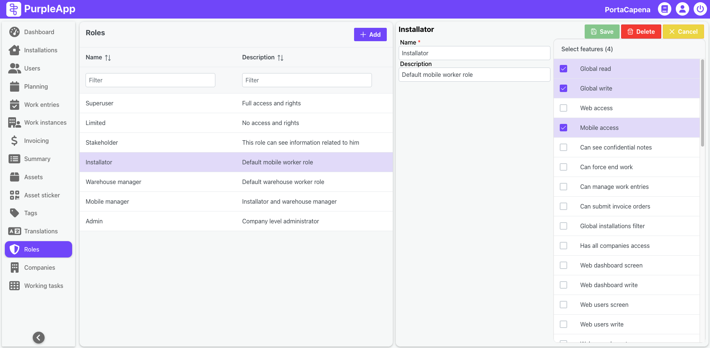

# Roles

## Overview

The **Roles** screen is designed for managing access rights for system users. This is where new roles are created, and the scope of rights and access levels for each role is defined.

_By default **Settings** screen is only visible to users with the administrator role._

## User interface

The screen is divided into two main sections:

- **Role List**: Displays the list of roles already added to the system, along with their descriptions. This section allows users to quickly identify and select a specific role for editing.

- **Access Rights**: Lists all possible access rights within the system that can be assigned to a user. Many of these rights refer to access levels for specific screens in the system, based on read rights (the user can only view data) and write rights (the user can input or modify data).

This structure enables administrators to tailor access rights to the needs and requirements of different user types.

## Role customization examples

- **Installer/Technician/Builder**:  
  These roles typically require only basic access to the mobile app, sufficient for performing their work. 
- **Supervisor**: A role that combines access to the mobile app and parts of the web application, enabling oversight of team members and their current tasks.
- **Manager**: Responsible for planning work for the entire team. This role often requires broader access to both mobile and web applications.
- **Investor/Client**: Though these roles do not modify system data, they are granted view-only access to monitor the current progress of teams at specific locations.

## Key benefits

The **Roles** screen ensures that access rights are fully customizable, empowering administrators to manage user access effectively. Whether it's a field worker, supervisor, manager, or client, the system provides precise control over the visibility and modification rights each user has.
