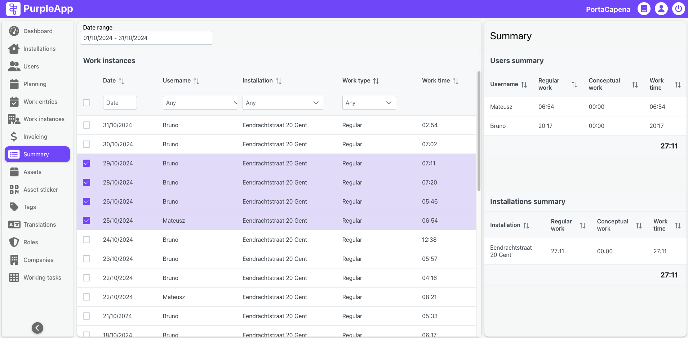

# Summary

## Overview

The **Summary** page in the Purple App enables users to analyze work time data for employees across various installation sites. It provides tools to select a specific time range, filter data by employees, installations, and work types, and dynamically display the aggregated results for detailed analysis. 

## User Interface

This page is structured into two main sections:

- **Work Instances Panel:** Allows users to define the analysis period, select relevant work instances, and apply filters.
- **Summary Results:** Displays aggregated work time statistics for employees and installations.

### Work Instances Panel

The left section allows users to configure the data for analysis. Key components include:

Date range selector: Specify the start and end dates for the analysis period.

Work instances table: Display a list of all work instances within the defined period. Each row includes the following columns:

  - Date: The date of the work instance.
  - Username: The employee who completed the work.
  - Installation: The location where the work was performed.
  - Work Type: The type of work (e.g., Regular or Conceptual).
  - Work Time: The duration of the work instance.

Users can select specific work instances by marking checkboxes in the table.

### Summary Results

The right section dynamically updates based on the selected work instances and filters. It includes:

**Users Summary:** Displays aggregated work times per user. Columns include:

  - Username.
  - Total time spent on Regular work.
  - Total time spent on Conceptual work.
  - Combined work time.

**Installations Summary:** Provides an overview of work times per installation. Columns include:

  - Installation.
  - Total time spent on Regular work.
  - Total time spent on Conceptual work.
  - Combined work time.

## Use Case Example

An administrator wishes to evaluate the total work time spent by employees at the "Eendrachtstraat 1" installation during October 2024. They:

1. Set the date range to **01/10/2024 - 31/10/2024**.
2. Filter the work instances by **Installation: Eendrachtstraat 1**.
3. View the aggregated results in the Summary Results section.

The results show:
- Total work time for each employee at the selected installation.
- Breakdown of Regular and Conceptual work.
