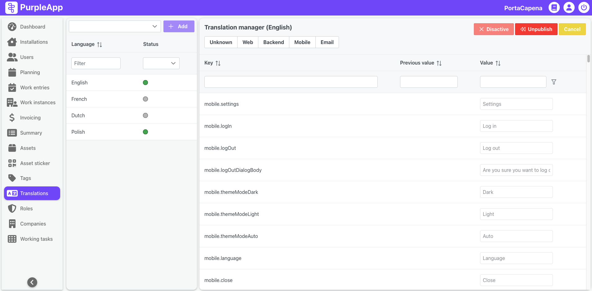

# Translations

## Overview

The **Translations** feature empowers users to manage multiple language versions of the application.  It allows adding new languages, translating interface elements for different parts of the system (like the web interface or mobile app), and activating or deactivating languages as needed.  This feature facilitates multilingual support, enabling the application to be used by a diverse user base.

_By default, the **Translations** screen is only visible to users with the Administrator role._

## User Interface

This page is structured into two main sections:

- **Languages panel:** Allows users to define the analysis period, select relevant work instances, and apply filters.
- **Translation manager:** Displays aggregated work time statistics for employees and installations.

### Languages Panel

The left section allows users to view and manage the list of available languages. Key components include:

- **Add language button:** Enables users to add a new language from the dropdown to the system.
- **Language:** The name of the language (e.g., English, Polish).
- **Status:** Indicates whether the language is active or inactive.

### Translation Manager

The right section is where users manage the translations for the selected language. Key components include:

- **Filter buttons:** Allows users to narrow down translations by system components (e.g., Web, Mobile).
- **Search bars:** Enables searching for specific translation keys or values.
- **Translations table:** Displays a list of keys and their corresponding translations. Each row includes:
  - **Key:** The identifier for the translatable element.
  - **Previous value:** Previous translation that can be restored.
  - **Value:** The user-provided translation for the selected language.

## Use Case Example

A manager wishes to add Lithuanian translations for the mobile application used by field technicians.

1. Navigate to the **Translations** page.
1. Click **Add Language** and select Lithuanian.
1. Use the **Filter** to select the Mobile component.
1. Enter translations for the keys in Lithuanian.
1. Activate the Lithuanian language using the **Status Toggle**.

Once activated, the Lithuanian language is immediately available to all mobile app users.
