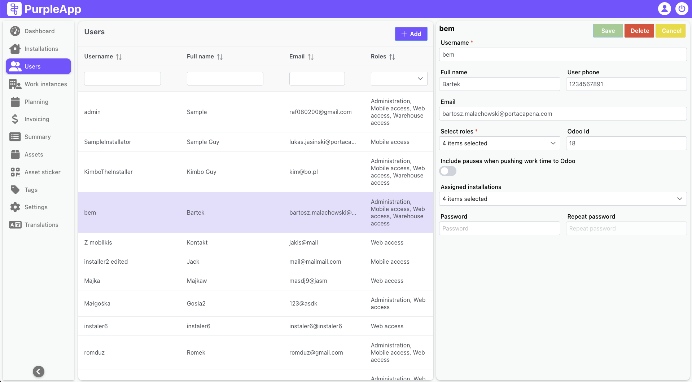

# Users

## Overview

The Users feature allows for the management of all system users. It provides a list view of all users with key information, and a detailed view for managing individual user accounts.  This includes creating new users, editing existing user details (such as contact information, roles, and assigned installations), and managing user access and permissions within the system.  User roles define access levels to different parts of the application and influence available functionalities.  The system also allows linking users to Odoo ERP for data synchronization.

## User Interface

The Users screen consists of two parts:

- On the left there is a list of all users registered in the system. 
- On the right side, details of the selected user are displayed.

### Users list
The user list contains the user's login and full name, contact email address and roles in the system. The list can be sorted and filtered by any column.
After finding and selecting user from the list, user's data will be displayed on the right side of the screen.

Also, at the top right there is an Add button used to create a new user in the system. After clicking it, on the right side of the screen an empty form will be displayed. After completing all required fields, you will be able to save new user.

### User details

At the top left of the right panel there is the name of the selected user. Next to it there are save, delete and cancel buttons.

- **Save** - Creates a new user or updates the details of an existing one. Available after making changes to the displayed data or after completing the required fields for a new user.
- **Delete** - Deletes currently displayed user. The action must be confirmed. The button is unavailable when creating a new user.
- **Cancel** - closes the currently displayed user details.

Data fields:

- **Username** – login with which the user will log in to the system/mobile app (preferably short, spaces are allowed). 
- **Email** – user's email. 
- **Full name** – user's full/real name. 
- **User phone** – user's phone number.
- **Select roles** - user's role in the system. Each role in the system is a pool of access (individual screens on the web and in the mobile application) and permissions (feelings, recording). Depending on your needs, new roles can be created with new sets of permissions and accesses. It is also possible to edit existing roles, but please note that the changes will apply to all users to whom this role is assigned.
Therefore, it is recommended to create a new role if necessary.

Updating a given user's roles may require logging out and logging in to the system again for the changes to take effect.

Possible options:

- Superuser - Access to all screens and features, also mobile app.
- Limited - No access.
- Stakeholder - Access to dashboard, installations, work instances and summary screens filtered by assigned installations.
- Installator - Access to mobile app for work registration. Default role for installers.
- Warehouse manager - Access to mobile app for warehouse management. Default role for warehouse workers.
- Mobile manager - Access to mobile app for work registration and warehouse management.

**Odoo Id** – used for linking PurpleApp users with Odoo contacts. 
This field is required for Purple to correctly send data to Odoo, but when creating a new user in PurpleApp, this user is not required to exist in Odoo for proper operation using the mobile application.
OdooId will only be required when pushing installer's work data to Odoo on the Invoicing page. Purple mechanisms validate user data and will prevent pushing data if OdooId is not set.

_Information on creating a new user in Odoo is provided later in the documentation._

**Assigned installations**  - list of installations to which the user is assigned to. It’s selected from multi-select list, so many installation can be set for the user. The work of a given installer can be planned in a given installation even if he is not assigned to it. 
These installations are visible to the installer in the mobile app in to the main screen in assigned installations section.

**Password** - password used to log in the system, for the web and mobile app. It must consist of at least 8 characters. When editing user data, this field can be left empty, then only the user's data will be updated and the password will remain unchanged.

**Repeat password** - password confirmation field, type it again to avoid typos, it must be the same as in the previous field.

