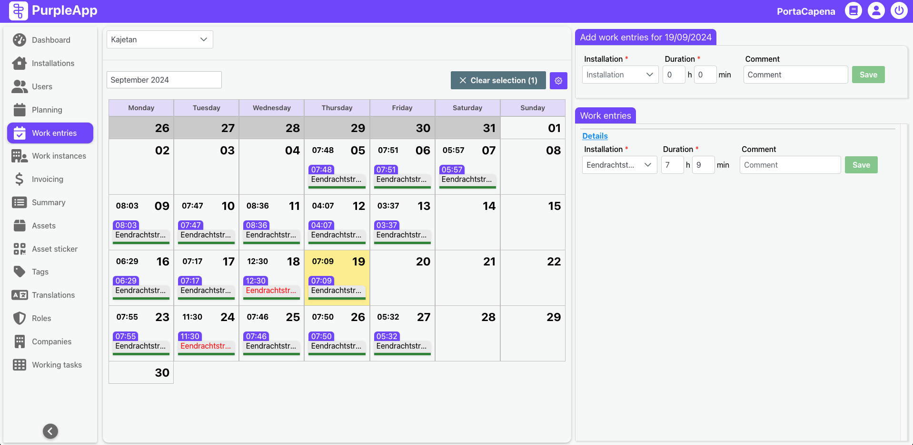

# Work entries

## Overview

The Working Entries screen is designed to provide a clear overview and control of recorded work time for individual employees on specific days. It allows for the review and, if necessary, correction of work time entries, ensuring accuracy in case of human error during work time registration. This feature helps maintain accurate records and facilitates timely intervention and discussion with employees when discrepancies are found.

## User Interface

The Working Entries screen is divided into two main sections:

- **Calendar** view occupying the central and larger portion of the screen.
- Detailed **work entry** information displayed on the right side.

### Calendar

Above the calendar itself, you will find a dropdown menu to select the employee whose work time entries you wish to view. Next to it, there is a month selection dropdown that determines the month displayed on the calendar.

The calendar itself displays information about the selected employee's work time in each location where they worked on a given day. Each cell in the calendar provides a summary of the work time entries for that day.

### Work Entries

This section displays detailed information for the day selected on the calendar.

*   If work time entries exist for the selected day, they will be displayed in this section. You can edit existing entries to correct any inaccuracies or omissions.

*   If no work time entries exist for the selected day, you can add a new entry. This is particularly useful for cases where an employee forgot to record their work time or was unable to do so due to unforeseen circumstances (e.g., equipment malfunction, personal reasons, etc.).

## Benefits

The Working Entries feature offers several important benefits:

*   **Proactive Issue Resolution:** Enables early detection of discrepancies, making it possible to address issues promptly and discuss them with the employee.

*   **Improved Data Integrity:** Enhances the overall integrity of work time data, which is crucial for payroll, project management, and other business processes.

*   **Enhanced Transparency:** Provides a transparent view of work time data for both employees and managers, promoting trust and accountability.

*   **Greater Control:** Gives managers greater control over work time data, allowing them to ensure compliance with company policies and labor laws.

*   **Facilitates Communication:** Provides a clear basis for discussing work time with employees, making it easier to address any concerns or issues.
