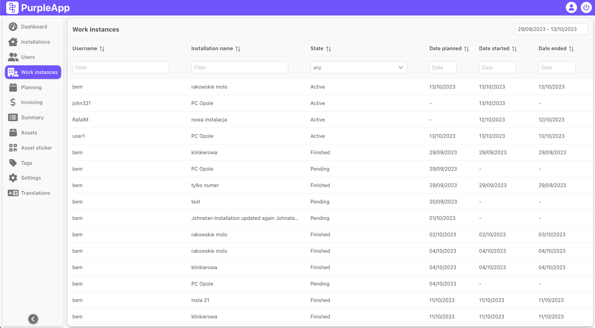
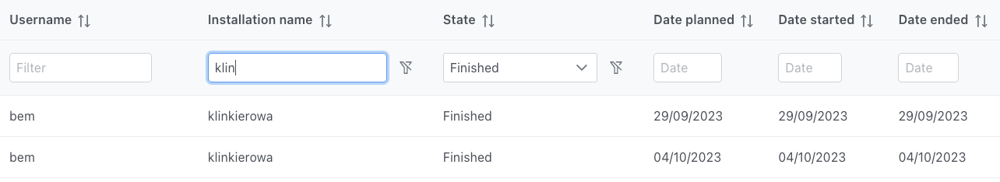
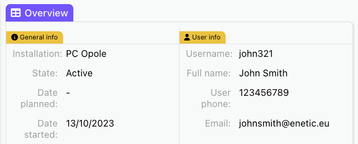
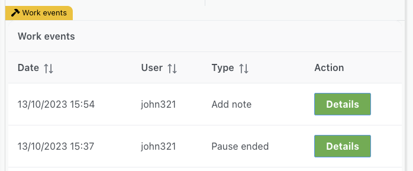
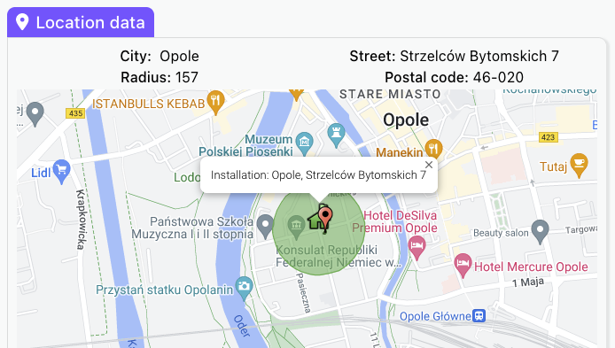
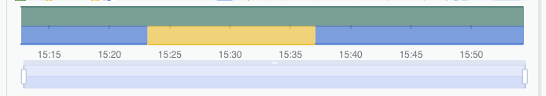

# Work instances

## Overview

A work instance represents the installer's work in a given installation started on a given day. It contains data about the work itself, such as installers and location data, start and end of the work, etc. as well as data regarding events recorded during it, such as pauses, notes and installed assets.

A work instance is created when planning the work of installers on the Planning page. It can be created without prior planning when the installer starts working in the assigned installation.

Each instance has a status that determines its current state. There are 3 statuses:

- **Pending** - This status means two things. The first, that work has been planned on the Planning page for a given installer in a specific installation on a given day. The second thing is that the work has not started.
- **Active** - Work is currently in progress. Its details can be observed on the Dashboard.
- **Ended** - The work has already been completed. If the work instance has a Ended status and it was ended today, its status may change back to Active, because the installer has the ability to continue previously completed work within the same day.

_You can learn more about work instance statuses on the [Planning](planning.md) page._

## User interface

The Work instances web data is divided into two screens:

- Work instances list screen
- Work instances details screen

In the first screen there is a list of all installations ready to be sorted and filtered by individual columns. 
The second screen is used to display detailed data about the installation itself, assigned installers, calendar of planned works, list of notes, assets and tasks assigned to this installation.

### Work instances list

At the top right there is a date selection field to set the time period for which the data will be displayed in the table.
The table contains data divided into individual columns described below. Data in the table can be sorted and filtered by each column.

Columns in the table:

- **Username** – Name of the user who performed the work.
- **Installation name** – Name of the installation in which the work took place.
- **State** – status of a given work instance.
- **Date planned** –  Planned start date of work. If the field is empty, it means that the work instance was not previously planned and was created after starting work in a given installation.
- **Date started** - Start date of work in a given installation.
- **Date ended** - The date on which work in a given installation was finished.

### Work instance details

The work instance details screen is divided into two parts. Overview on the left side contains all work instance data and Location data on the right with a map of installation area and a chart like on the Dashboard.

#### Overview section

Overview part is divided into three sections:

- General info - Contains information about the instance status, the name of the installation in which the work took place, the dates of planning, start and end of work, additional comments and information about the duration of work and pauses.
- User info - Contains name of the user who performed the work, full name and contact details.
- Work events - This section contains a table with all events that happened during this work instance. In addition to the event date and time and username there is an info about the type of the event and details button.

Work event describes an action that took place during installer's work. This can be the start of work, its end, continuation of work or pause, but also installing an asset or adding a note that may contain a comment and/or multiple photos.

**Details** button in Action column displays a new modal containing additional information for notes like a Comment field in which a comment is displayed. If the note contain photos, additional information about the number of photos is displayed under the data, followed by the photos one below the other.

#### Location data

On this side of the screen there is a map containing the installation location with marked working area.

At the top of the map there is installation address and radius in meters.

At the bottom of the map there is a work and presence chart with a zoom bar. More about this chart can be found in the [Work chart](dashboard.md#work-chart) description on Dashboard page. The difference between the charts in these two places is that on the Dashboard, work is still ongoing and something new may appear on the chart. In the case of a chart on the work instance page, the work is already completed.