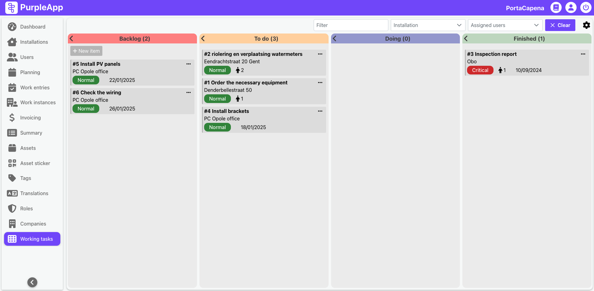
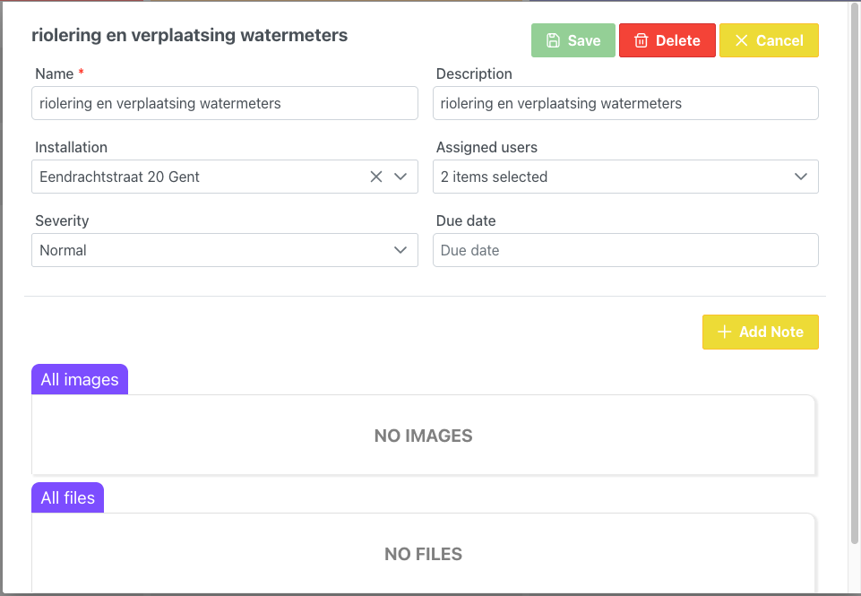

# Working Tasks

## Overview

The Working Tasks screen is designed for managing specific tasks that require close monitoring. It allows for the creation and management of task lists, including when tasks can be started, who is responsible for them, and their location, based on the details specified for each task. This management is facilitated through a Kanban board, which offers several advantages for this purpose:

*   **Visualization:** Kanban boards provide a clear visual representation of the workflow, making it easy to understand the status of each task at a glance.
*   **Workflow Management:** Kanban boards help to manage and optimize the flow of work, ensuring that tasks move smoothly from start to finish.
*   **Collaboration:** Kanban boards can improve team collaboration by making task assignments and progress transparent to all team members.
*   **Flexibility:** Kanban boards can be easily adapted to changing priorities and requirements.

## User Interface

The Working Tasks screen features a Kanban board interface, which provides a clear overview of all tasks and their current status.

At the top of the screen, you will find filters that allow you to refine the tasks displayed by criteria such as:

*   **Filter:** Allows you to search tasks by name or description.
*   **Installation:** Allows you to filter tasks by the installation they are related to.
*   **Assigned Users:** Allows you to filter tasks by the users assigned to them.

### Kanban board
The Kanban board is divided into four columns, each representing a different stage of the task lifecycle:

*   **Backlog:** This column contains tasks that have been created but are not yet ready to be started. Treat this column as a notebook of sorts.
*   **To Do:** This column contains tasks that are ready to be started and are waiting to be assigned to a user. Tasks in this column are visible in the mobile app.
*   **Doing:** This column contains tasks that are currently being worked on. When a user starts a task in the mobile application, it will move from the "To Do" column to the "Doing" column.
*   **Finished:** This column contains tasks that have been completed.

When creating or editing a task, you can specify the users that are assigned to the task. These users will be able to see the task in their mobile application.

### Task window

The Task Creation/Edition screen allows you to specify all the details of a task. 

The fields that can be filled out include:

*   **Name:** The name of the task.
*   **Description:** A description of the task, providing more context and details about what needs to be done.
*   **Installation:** The installation where the task needs to be performed.
*   **Assigned Users:** The users that are assigned to the task. Only selected users will see the task in the mobile app. If no user is assigned to a given task, then every employee working in the installation will see it and will be able to start doing it.
*   **Severity:** The priority of the task (low, normal, high, critical). 
*   **Due Date:** The date by which the task needs to be completed.

Additionally, you can add notes to the task, which can be used to provide updates on progress or to share relevant information. You can also add files to the task, such as instructions or photos that can assist the users in completing the task. They can be added over time as the task is being completed.

## Benefits

This approach to task management offers several key benefits:

*   **Improved Organization:**  Tasks are clearly organized and easily accessible, promoting better workflow management.
*   **Increased Efficiency:**  Streamlined task assignment and progress tracking lead to greater team efficiency.
*   **Enhanced Collaboration:**  Transparent task statuses and the ability to add notes and files facilitate team communication and collaboration.
*   **Better Monitoring:**  Real-time visibility of task progress allows for quick identification and resolution of potential bottlenecks or issues.
*   **Greater Flexibility:**  The Kanban board structure allows for easy adaptation to changes in priorities and requirements.
*   **Empowered Field Technicians:** Mobile integration ensures that field technicians have immediate access to task details and can update task status on the go.